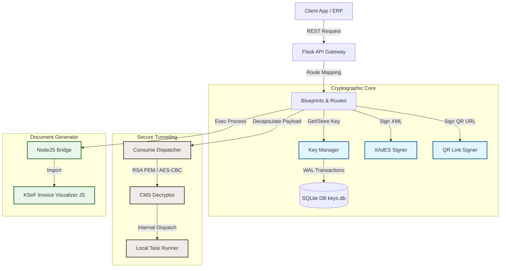

# KSeF Integration API

A robust, enterprise-grade REST API designed to facilitate seamless integration with the Polish National e-Invoice System (KSeF - Krajowy System e-Faktur). Built with Flask, Gunicorn, and SQLite, it serves as a secure cryptographic gateway for handling session token encryption, enveloped XAdES XML signing, offline QR verification link signing, and visual PDF generation.

---

## Table of Contents

- [Architecture Overview](#architecture-overview)
- [Key Features](#key-features)
- [Project Directory Structure](#project-directory-structure)
- [System Requirements & Configuration](#system-requirements--configuration)
- [Local Installation & Setup](#local-installation--setup)
- [API Endpoints Reference](#api-endpoints-reference)
  - [1. `/` (Base Metadata)](#1---base-metadata)
  - [2. `/health` (Health Check)](#2-health-health-check)
  - [3. `/encrypt` (RSA-OAEP Encryption)](#3-encrypt-rsa-oaep-encryption)
  - [4. `/sign_xml` (XAdES Enveloped Signing)](#4-sign_xml-xades-enveloped-signing)
  - [5. `/sign_link` (QR Verification Link Signing)](#5-sign_link-qr-verification-link-signing)
  - [6. `/generatePDF` (Invoice Visualization PDF)](#6-generatepdf-invoice-visualization-pdf)
  - [7. `/get_pub_cert` (Internal Key Management)](#7-get_pub_cert-internal-key-management)
  - [8. `/consume` (Secure Encrypted Tunnel)](#8-consume-secure-encrypted-tunnel)
- [Production Deployment](#production-deployment)
  - [Running with Gunicorn](#running-with-gunicorn)
  - [Running as a Systemd Service](#running-as-a-systemd-service)
  - [Running with Docker and Docker Compose](#running-with-docker-and-docker-compose)
- [Cryptographic Specifications](#cryptographic-specifications)
- [License](#license)

---

## Architecture Overview

The API acts as a cryptographic microservice, managing local key persistence, delegating heavy PDF rendering to a Node.js process, and supporting a secure encrypted channel for remote actions.



---

## Key Features

*   **RSAES-OAEP Encryption:** High-security session token encryption using MGF1 + SHA-256 schemes matching KSeF gateway entry requisites.
*   **XAdES Enveloped XML Signing:** Signs invoices using XMLDSig/XAdES enveloped method supporting both RSA-SHA256 and ECDSA-SHA256 signatures.
*   **Offline QR Code Signing:** Cryptographically registers verification URLs with RSA-PSS or ECDSA (P-256) signatures outputted in URL-Safe Base64 format.
*   **PDF Invoice Rendering:** Converts XML invoices to visualization PDFs on-demand using an integrated Node.js converter module.
*   **Encrypted Gateway (`/consume`):** Encrypts and decrypts payloads via CMS (Cryptographic Message Syntax) and AES-CBC, ensuring cryptographic commands run securely in transit without exposing raw keys.
*   **Dynamic Credential Manager:** Automatically generates, stores, and clears expired RSA keys inside SQLite, keeping active credentials secure and lightweight.
*   **Swagger OpenAPI Docs:** Out-of-the-box Interactive API Sandbox using Swagger UI.

---

## Project Directory Structure

*   [encrypt_service.py](file:///home/grzegorz/PycharmProjects/KSeF-RSA-Encryptor-API/encrypt_service.py) - Main Flask application initialization and route blueprint registration.
*   [swaggerapi.yaml](file:///home/grzegorz/PycharmProjects/KSeF-RSA-Encryptor-API/swaggerapi.yaml) - Full OpenAPI 3.0 API documentation specifications.
*   [pdf_generator_bridge.mjs](file:///home/grzegorz/PycharmProjects/KSeF-RSA-Encryptor-API/pdf_generator_bridge.mjs) - Node.js ESM bridge script acting as a middle-tier interface for PDF creation.
*   [core/](file:///home/grzegorz/PycharmProjects/KSeF-RSA-Encryptor-API/core) - Core business logic and database interactions.
    *   [core/config.py](file:///home/grzegorz/PycharmProjects/KSeF-RSA-Encryptor-API/core/config.py) - Application environment configuration defaults.
    *   [core/database.py](file:///home/grzegorz/PycharmProjects/KSeF-RSA-Encryptor-API/core/database.py) - SQLite connection manager and WAL-based schema migration tables.
    *   [core/key_manager.py](file:///home/grzegorz/PycharmProjects/KSeF-RSA-Encryptor-API/core/key_manager.py) - System ID (SID) keypairs lifespan generator and cleanup.
    *   [core/crypto_utils.py](file:///home/grzegorz/PycharmProjects/KSeF-RSA-Encryptor-API/core/crypto_utils.py) - Lower-level PyCA Cryptography helpers (CMS, AES, Key-Serialization).
    *   [core/consume_service.py](file:///home/grzegorz/PycharmProjects/KSeF-RSA-Encryptor-API/core/consume_service.py) - Payload decrypter, executor, and encrypter for secure tunneling.
    *   [core/pdf_service.py](file:///home/grzegorz/PycharmProjects/KSeF-RSA-Encryptor-API/core/pdf_service.py) - Wrapper executing Node.js processes for PDF building.
*   [routes/](file:///home/grzegorz/PycharmProjects/KSeF-RSA-Encryptor-API/routes) - Blueprint Controllers mapping HTTP request parameters to services.
    *   [routes/misc.py](file:///home/grzegorz/PycharmProjects/KSeF-RSA-Encryptor-API/routes/misc.py) - Health check and index metadata endpoints.
    *   [routes/legacy_encrypt.py](file:///home/grzegorz/PycharmProjects/KSeF-RSA-Encryptor-API/routes/legacy_encrypt.py) - Standard plaintext RSA encryption controller.
    *   [routes/sign_xml.py](file:///home/grzegorz/PycharmProjects/KSeF-RSA-Encryptor-API/routes/sign_xml.py) - XAdES enveloped signing handler.
    *   [routes/sign_link.py](file:///home/grzegorz/PycharmProjects/KSeF-RSA-Encryptor-API/routes/sign_link.py) - Offline verification QR-link signing handler.
    *   [routes/pdf.py](file:///home/grzegorz/PycharmProjects/KSeF-RSA-Encryptor-API/routes/pdf.py) - PDF invoice visualizer endpoint.
    *   [routes/internal_keys.py](file:///home/grzegorz/PycharmProjects/KSeF-RSA-Encryptor-API/routes/internal_keys.py) - API for fetching public keys/certificates of active SID.
    *   [routes/consume.py](file:///home/grzegorz/PycharmProjects/KSeF-RSA-Encryptor-API/routes/consume.py) - Secure RPC gateway dispatcher.

---

## System Requirements & Configuration

*   **Python:** Version 3.10 or higher
*   **Node.js:** Version 20 or higher (necessary for visualizer execution)

### Environment Variables

| Variable Name | Default Value | Description |
|:---|:---:|:---|
| `PORT` | `5000` | Port where Flask/Gunicorn binds the API. |
| `KEY_DB_PATH` | `instance/keys.db` | Location of the SQLite key-manager database. |
| `KEY_TTL_SECONDS` | `86400` (24h) | Time-To-Live (TTL) for generated dynamic keys. |
| `KSEF_NODE_BIN` | `node` | Executable path for running Node.js. |
| `KSEF_PDF_BRIDGE_PATH` | `./pdf_generator_bridge.mjs` | Path to the PDF Node.js bridge. |
| `KSEF_PDF_MODULE_PATH` | `./pdf-generator/dist/ksef-fe-invoice-converter.js` | Built path of the visualizer entrypoint. |
| `KSEF_PDF_TIMEOUT_SECONDS` | `60` | Execution timeout limit for rendering single PDFs. |

---

## Local Installation & Setup

1.  **Clone the repository:**
    ```bash
    git clone https://github.com/zvgelo/KSeF-RSA-Encryptor-API.git
    cd KSeF-RSA-Encryptor-API
    ```

2.  **Ensure Node.js and Visualizer exist:**
    Ensure Node.js 20 is installed. Make sure the visualizer build is present in:
    `pdf-generator/dist/ksef-fe-invoice-converter.js`

3.  **Setup Python environment and install packages:**
    ```bash
    python3 -m venv .venv
    source .venv/bin/activate  # Windows: .venv\Scripts\activate
    pip install -r requirements.txt
    ```

4.  **Run Development Server:**
    ```bash
    python encrypt_service.py
    ```
    The server will start on `http://localhost:5000`. Interactive documentation is available at `http://localhost:5000/apidocs`.

---

## API Endpoints Reference

### 1. `/` (Base Metadata)
Returns standard system identifiers, version tags, and core document paths.
*   **Method:** `GET`
*   **Response (200 OK):**
    ```json
    {
      "service": "KSeF Integration API 1.3.0",
      "docs": "/apidocs",
      "health": "/health",
      "generate_pdf": "/generatePDF"
    }
    ```

### 2. `/health` (Health Check)
Monitors API availability and database readiness status.
*   **Method:** `GET`
*   **Response (200 OK):**
    ```json
    {
      "status": "ok",
      "service": "KSeF Integration API",
      "version": "1.3.0"
    }
    ```

### 3. `/encrypt` (RSA-OAEP Encryption)
Encrypts raw input payload (usually a session token generated on the client-side) with a KSeF public key extracted from their PEM certificate.
*   **Method:** `POST`
*   **Request JSON:**
    ```json
    {
      "data_b64": "ZGFuZV9pbnB1dA==",
      "cert_b64": "MIIBIjANBgkqhkiG9w0BAQEFAAOCAQ8AMIIBC..."
    }
    ```
*   **Response (200 OK):**
    ```json
    {
      "status": "ok",
      "encrypted_b64": "eGlkY2FlYmQ5Mm..."
    }
    ```

### 4. `/sign_xml` (XAdES Enveloped Signing)
Signs XML invoices using XAdES enveloped signatures according to Ministry of Finance specifications.
*   **Method:** `POST`
*   **Request JSON:**
    ```json
    {
      "xml_b64": "PEF1dGhUb2tlblJlcXVlc3Q+Li4uPC9BdXRoVG9rZW5SZXF1ZXN0Pg==",
      "cert_pem_b64": "LS0tLS1CRUdJTiBDRVJUSUZJQ0FURS0tLS0t...",
      "key_pem_b64": "LS0tLS1CRUdJTiBFTkNSWVBURUQgUFJJVkFURSBLRVktLS0tLQ==",
      "key_password_b64": "emFxMUBXU1hjZGUzJFJGVg==",
      "alg": "rsa_sha256" // or ecdsa_sha256
    }
    ```
*   **Response (200 OK):**
    ```json
    {
      "signed_xml_b64": "PD94bWwgdmVyc2lvbj0iMS4wIiBlbmNvZGluZz0idXRmLTgiPz4...",
      "alg_used": "rsa_sha256"
    }
    ```

### 5. `/sign_link` (QR Verification Link Signing)
Appends a cryptographic verification signature to a KSeF offline verification URL.
*   **Method:** `POST`
*   **Request JSON:**
    ```json
    {
      "link_b64": "cXItZGVtby5rc2VmLm1mLmdvdi5wbC9jZXJ0aWZpY2F0ZS9OaXAvODExM...",
      "cert_pem_b64": "LS0tLS1CRUdJTiBDRVJUSUZJQ0FURS0tLS0t...",
      "key_pem_b64": "LS0tLS1CRUdJTiBFTkNSWVBURUQgUFJJVkFURSBLRVktLS0tLQ==",
      "key_password_b64": "emFxMUBXU1hjZGUzJFJGVg==",
      "alg": "rsa_pss", // or ecdsa_p256
      "ecdsa_format": "p1363" // or der (only for ecdsa)
    }
    ```
*   **Response (200 OK):**
    ```json
    {
      "link_b64": "aHR0cHM6Ly9xci1kZW1vLmtzZWYubWYuZ292LnBsL2Nl...",
      "alg_used": "rsa_pss",
      "ecdsa_format_used": null
    }
    ```

### 6. `/generatePDF` (Invoice Visualization PDF)
Renders a visual PDF document representing the structured XML invoice.
*   **Method:** `POST`
*   **Request JSON:**
    ```json
    {
      "xml_b64": "PEF1dGhUb2tlblJlcXVlc3Q+Li4u",
      "response_type": "base64", // or binary
      "additional_data": {
        "nrKSeF": "20260101-1234567890-ABCDEF1234567890",
        "qrCode": "https://...",
        "isMobile": false
      }
    }
    ```
*   **Response (Base64 Output):**
    ```json
    {
      "status": "ok",
      "pdf_b64": "JVBERi0xLjQKJcTl8uXr..."
    }
    ```
*   **Response (Binary Output):**
    Headers: `Content-Type: application/pdf` with inline `Content-Disposition: filename="invoice.pdf"`.
    *Example binary Curl command:*
    ```bash
    curl -X POST "http://localhost:5000/generatePDF" \
      -H "Content-Type: application/json" \
      -d '{"xml_b64":"PEF1dGhUb2tlblJlcXVlc3Q+Li4u","response_type":"binary"}' \
      --output invoice.pdf
    ```

### 7. `/get_pub_cert` (Internal Key Management)
Generates or fetches an active internal RSA keypair and self-signed certificate bound to a specific System ID (`sid`). Used to establish credentials for secure tunneling.
*   **Method:** `POST`
*   **Request JSON:**
    ```json
    {
      "sid": "SYS123" // Must match: ^[A-Z0-9]{6}$
    }
    ```
*   **Response (200 OK):**
    ```json
    {
      "sid": "SYS123",
      "kid": "8d3cfb5b-21fb-4e1b-9fca-5777df50ad6d",
      "created_at": 1714560000,
      "expires_at": 1714646400,
      "public_key_pem_b64": "LS0tLS1CRUdJTiBQVUJMSUMgS0VZLS0tLS0...",
      "public_cert_pem_b64": "LS0tLS1CRUdJTiBDRVJUSUZJQ0FURS0tLS0t..."
    }
    ```

### 8. `/consume` (Secure Encrypted Tunnel)
Accepts an encrypted payload wrapped using the active public key fetched from `/get_pub_cert`. Decrypts the request internally using CMS/AES, executes the dynamic target command (e.g. `/encrypt`), and returns an encrypted response.

```
Request payload wrapping flow:
[JSON plaintext payload] --> Encrypted via AES-256-CBC with random Key and IV
  ├── AES Key is enveloped inside CMS structure using the SID/KID's public key certificate
  └── Enveloped Key + IV + Ciphertext is sent in Request
```

*   **Method:** `POST`
*   **Request JSON:**
    ```json
    {
      "sid": "SYS123",
      "kid": "8d3cfb5b-21fb-4e1b-9fca-5777df50ad6d",
      "enc_key_b64": "MIIByQYJKoZIhvcNAQcDoIIBujCCAbYCAQA...", // Enveloped AES key (CMS format)
      "iv_b64": "cGFzc3dvcmQxMjM0NTY3OA==",
      "ciphertext_b64": "Y2lwaGVydGV4dF9zb21ldGhpbmc=", // Encrypted inner request
      "reply_cert_pem_b64": "LS0tLS1CRUdJTiBDRVJUSUZJQ0FURS0tLS0t..." // Optional Client certificate to encrypt response
    }
    ```
*   **Response (No Reply Cert):**
    ```json
    {
      "status": "ok",
      "plaintext_b64": "eyJzdGF0dXMiOiJvayIsImVuY3J5cHRlZF9iNjQiOiIuLi4ifQ=="
    }
    ```
*   **Response (With Reply Cert):**
    Returns encrypted envelope structure representing the response:
    ```json
    {
      "status": "ok",
      "reply": {
        "enc_key_b64": "MIIByQYJKoZI...",
        "iv_b64": "cGFzc...",
        "ciphertext_b64": "Y2lwaGVy..."
      }
    }
    ```

---

## Production Deployment

### Running with Gunicorn

For production performance, use Gunicorn to run multiple concurrent workers:
```bash
gunicorn --workers 3 --threads 2 --bind 0.0.0.0:5000 encrypt_service:app
```

### Running as a Systemd Service

Create a systemd unit configuration file to run the API as a background daemon:
```bash
sudo nano /etc/systemd/system/ksef-encryptor.service
```

Paste the following configurations (adjust user accounts and installation paths according to environment needs):

```ini
[Unit]
Description=KSeF Integration API Gunicorn Service
After=network.target

[Service]
User=ubuntu
Group=ubuntu
WorkingDirectory=/home/ubuntu/KSeF-RSA-Encryptor-API

# Supply explicit Node.js environment paths if installed via nvm
Environment="KSEF_NODE_BIN=/home/ubuntu/.nvm/versions/node/v20.20.2/bin/node"
Environment="PATH=/home/ubuntu/.nvm/versions/node/v20.20.2/bin:/usr/local/bin:/usr/bin:/bin"

Environment="PORT=5000"
Environment="WORKERS=3"
Environment="THREADS=2"
ExecStart=/home/ubuntu/KSeF-RSA-Encryptor-API/.venv/bin/gunicorn --workers ${WORKERS} --threads ${THREADS} --bind 0.0.0.0:${PORT} encrypt_service:app
Restart=always
RestartSec=5
StandardOutput=append:/var/log/encrypt_service.log
StandardError=append:/var/log/encrypt_service.err

[Install]
WantedBy=multi-user.target
```

Enable and start the service:
```bash
sudo systemctl daemon-reload
sudo systemctl enable ksef-encryptor.service
sudo systemctl start ksef-encryptor.service
```

Verify service status:
```bash
sudo systemctl status ksef-encryptor.service
```

### Running with Docker and Docker Compose

1.  **Build Docker Image:**
    ```bash
    docker build -t ksef-encryptor:local .
    ```

2.  **Run Docker Container:**
    ```bash
    docker run -d \
      -p 5000:5000 \
      -e PORT=5000 \
      -e WORKERS=3 \
      -e THREADS=2 \
      --name ksef-encryptor \
      ksef-encryptor:local
    ```

3.  **Run with Docker Compose:**
    ```bash
    docker compose up -d
    ```
    This will bind the application port internally, run continuous health checks every 30s, and expose the service externally on port 5001.

---

## Cryptographic Specifications

*   **Asymmetric Encryption:** RSAES-OAEP utilizing MGF1 masking functions with SHA-256 hashing digests. Default key sizes are generated at 2048 bits.
*   **Symmetric Encryption:** AES-256 in Cipher Block Chaining (CBC) mode with standard PKCS7 padding.
*   **XML Signatures:** XMLDSig / enveloped XAdES with UTF-8 normalization (Exclusive Canonicalization 1.1) using either RSA-SHA256 or ECDSA-SHA256 (secp256r1/P-256 curve).
*   **QR Link Signatures:** Verification links are signed using RSA-PSS padding or ECDSA P-256 curves, creating URL-safe signatures (RFC 4648 Base64URL without padding bytes).
*   **CMS Enveloping:** IETF Cryptographic Message Syntax (RFC 5652) enveloped-data structures wrapping symmetric keys.

---

## License

Distributed under the MIT License. Use of this code is subject to company guidelines and internal cryptographic governance.

**Author:** [KBJ DRA](https://github.com/zvgelo/KSeF-RSA-Encryptor-API)
